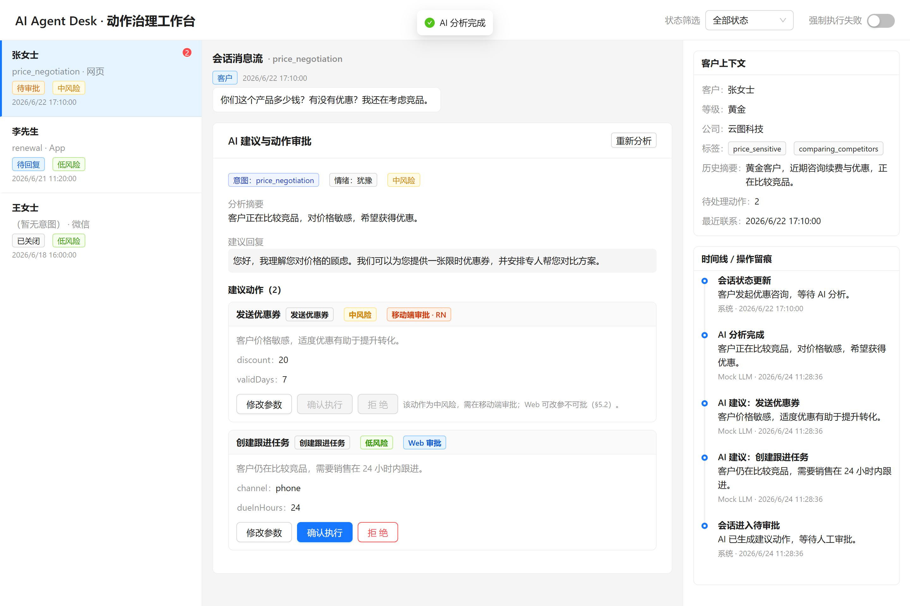
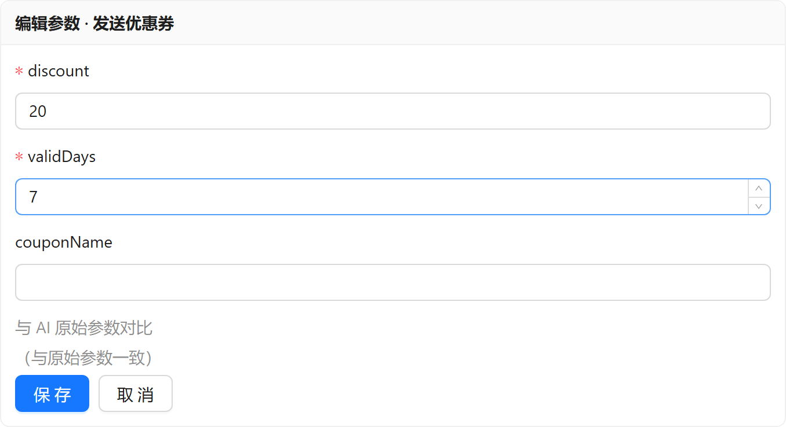
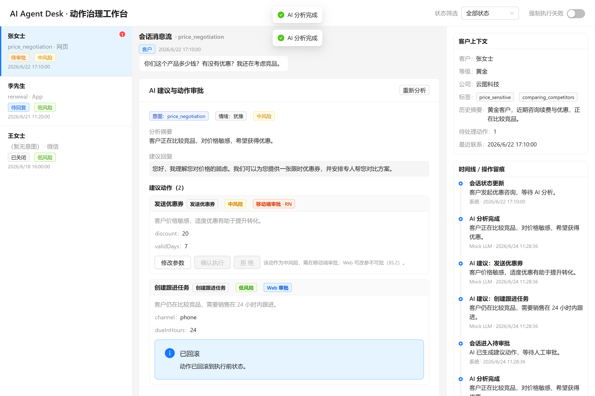

# AI Agent Desk

[](https://github.com/weijianjunwjj/ai-agent-desk/actions/workflows/ci.yml)


[](LICENSE)

> 面向企业客服 / 销售 / 运营场景的**多端 AI 动作治理工作台**。
>
> **AI 负责提速，人类负责裁决，系统负责留痕。**

当 AI 在客户会话中建议「发券 / 创建跟进任务 / 升级工单 / 转人工 / 更新客户状态」时，系统不让 AI 直接执行，而是把建议动作转化为**可编辑、可审批、可执行、可回滚、可追踪、可移动审批**的业务卡片，由人类确认后再执行。

承重墙是 **ToolApprovalCard** —— AI 建议动作的状态机可视化载体。这条链路做深，比铺十个浅页面更重要：

```
AI 建议动作 → 人工确认 → 可编辑 → 可执行 → 可回滚 → 可留痕 → 可移动审批
```

> 这是一个**求职补强工程化原型**：证明"把 AI 从聊天框里的文本生成器，推进到企业系统里的可治理业务动作"的能力。不是上线商用系统，刻意不做登录 / 权限 / 多租户 / 真实 LLM（见 [Out of Scope](#out-of-scope)）。

---

## 核心闭环

```
Web 选择客户会话 → 客户消息触发 AI 分析（Mock LLM Adapter，结构化输出过 Zod 校验）
  → 生成 AIAnalysis + 若干 ToolAction（建议动作）
  → 按 requiresMobileApproval(action.riskLevel) 分流：
     · 低风险（low）          → Web 审批：改参 → 确认 → executing → success /（强制失败 → rollback）
     · 中/高风险（medium/high）→ Web 不可批，仅可看/改参；推送到 RN 审批
  → RN 收到（模拟）推送 → 审批详情：同意 / 拒绝 / 修改后同意 / 稍后处理
  → RN 裁决驱动同一套 XState 状态机 → 回执
  → 每一步写入 Timeline 留痕
```

默认 demo（张女士 · 优惠咨询）天然覆盖两条分流分支。完整脚本见 [`docs/DEMO_SCRIPT.md`](docs/DEMO_SCRIPT.md)。

---

## 截图

> 截图占位：按 [`docs/DEMO_SCRIPT.md`](docs/DEMO_SCRIPT.md) 跑一遍 demo，把图片放入 [`docs/screenshots/`](docs/screenshots/)（文件名见下，放好即自动显示）。

| Web 工作台 | Web 参数编辑 + diff | Web 失败 → 回滚 |
|---|---|---|
|  |  |  |

| RN 待审批列表 | RN 审批详情（修改后同意） | RN 状态回执 |
|---|---|---|
|  |  |  |

---

## 技术栈

| 层 | 技术 |
|---|---|
| **Web** | Vite 6 · React 19.1 · TypeScript · React Router 7 · TanStack Query 5 · Zustand 5 · Ant Design v5 |
| **Mobile** | Expo SDK 54 · React Native 0.81 · React 19.1 · Expo Router · FlashList · Zustand · `@xstate/react` · Expo Notifications |
| **Shared** | TypeScript 类型 · **Zod v3** schema · **XState v5** 状态机 · 审批分流策略 · schema 内省工具（**不含 React / UI**） |
| **Mock AI** | 纯 TypeScript module（Mock LLM Adapter，不接真实 LLM） |
| **工程** | pnpm workspaces · ESLint 9 flat config · Vitest · GitHub Actions CI |

React 19.1 + Expo SDK 54 的基线选择见 [`docs/adr/0001-adopt-react-19.md`](docs/adr/0001-adopt-react-19.md)（Accepted）。

---

## 仓库结构

```
ai-agent-desk/
├── apps/
│   ├── web/        # Vite + React Web 工作台（三栏：会话列表 / 消息流+AI 建议 / 客户上下文+Timeline）
│   └── mobile/     # Expo React Native 审批收件箱（Expo Router 三屏）
├── packages/
│   ├── shared/     # 类型 / Zod schema / XState approvalMachine / 审批分流策略（无 React）
│   └── mock-ai/    # Mock LLM Adapter（纯 TS）
└── docs/
    ├── PRD.md             # 唯一事实源（frozen spec）
    ├── STATE_MACHINE.md   # ToolApprovalCard 状态机文档
    ├── DEMO_SCRIPT.md     # 演示脚本
    ├── adr/0001-adopt-react-19.md
    ├── DECISIONS.md / HANDOFF.md / PROGRESS.md   # 多 Agent 接力开发记录
```

承重墙状态机详见 [`docs/STATE_MACHINE.md`](docs/STATE_MACHINE.md)：8 态（`suggested / editing / approved / rejected / executing / success / failed / rollback`），`approved` 为瞬时态，`rejected`/`rollback` 为终态。**Web 与 RN 共享同一台 `approvalMachine` 定义**。

---

## 本地运行

需要 Node ≥ 20 与 `pnpm`（仓库用 `pnpm@9.15.2`）。

```bash
pnpm install          # 安装依赖（monorepo，node-linker=hoisted）
pnpm -w check         # 质量闸门：tsc + eslint + vitest（应全绿，21 个契约测试）
```

**一键启动 Web + RN（并行）：**

```bash
pnpm dev              # 同时起 Web(vite) 与 RN(expo start)，日志按包名前缀交错输出
pnpm dev:web          # 只起 Web
pnpm dev:mobile       # 只起 RN（需要操作 Expo 交互菜单时单独起更顺手）
```

**Web 工作台：**

```bash
pnpm --filter @ai-agent-desk/web dev      # http://localhost:5173
pnpm --filter @ai-agent-desk/web build    # 生产构建
```

**RN 审批端（移动）：**

```bash
pnpm --filter @ai-agent-desk/mobile start     # 启动 Expo，用 Expo Go 扫码（iOS/Android 真机）
pnpm --filter @ai-agent-desk/mobile exec expo start --web   # 浏览器预览（react-native-web）
```

> 只有 iPhone、没有安卓？没问题：装 App Store 的 **Expo Go**，`expo start` 后用相机扫二维码即可在 iOS 真机运行；本地通知（Step 10）在真机 Expo Go 上可完整体验。浏览器 `--web` 模式用于快速迭代，系统通知会降级为应用内直达。

---

## 关键设计决策与 Tradeoff

### 为什么 Web 用 Vite + React 而不是 Next.js

这是一个**内部 AI 动作治理工作台**，不依赖 SSR / SEO / SSG / ISR / RSC / 内容站首屏优化。Web 端是典型 SPA：会话列表、消息流、AI 建议、ToolApprovalCard、Timeline、状态机驱动的复杂客户端交互。

> 面试口径：项目核心是**复杂客户端状态建模、AI 动作审批流与多端共享状态机**。Next.js 的强项（SSR/RSC）不在这里，强上反而引入 Server/Client 边界与 RSC 心智负担。后续若需 RSC Generative UI 或岗位关键词，可平滑迁移 Web 层，而核心 `shared`（类型 / schema / 状态机）不会浪费。

### 为什么 RN 是"审批收件箱"而不是完整移动工作台

按权责分流（§5.2），**一个 ToolAction 只有一个审批方**：低风险在 Web、中/高风险在 RN。移动端的真实场景是销售/主管在外**及时处理高优先级审批**，不需要在手机上重建整个工作台。RN 只做三屏：待审批列表 / 审批详情 / 状态回执。它复用 `packages/shared` 的类型、schema、状态机与分流策略 —— **同一套业务规则，两端一致**，这正是 monorepo + framework-free shared 层的价值。

### 为什么 Zod-first + 判别联合定型工具参数

数据模型一律 Zod-first（`z.infer` 派生类型，不写平行 interface）。`ToolAction` 用**判别联合**按 `type` 给 `params` 定型，而非退回 `Record<string, unknown>`：

- AI 输出整体过 `AIAnalysisSchema` 校验，非法参数被拒（mock bug 立刻暴露）。
- 参数编辑表单**由 schema 驱动渲染**（`getSchemaFields` 内省 Zod schema），新增动作类型只改 schema、不改 UI。
- Web（AntD 表单）与 RN（原生表单）**共用同一份 schema 与内省逻辑**做校验。

### 为什么用 XState 而不是散落的 useState

ToolAction 生命周期是真正的状态机（8 态、含瞬时态与回滚），用 `if-else` / `useState` 分散实现会失控。`approvalMachine` 定义放 `shared`（框架无关、可被 Web/RN 同时消费、可出图讲解），`@xstate/react` 绑定放各 app。**一个 ToolAction 一台机器实例**（每张卡一台）。React 19 的 `useActionState`/`useOptimistic` 仅用于 UI 表现层，业务状态流转只归状态机。

### 为什么是 Mock LLM Adapter 而不是真实 LLM

MVP 聚焦"AI 动作治理"这条刀尖，而非模型能力。Mock LLM Adapter 是纯 TS module，产出固定结构化 `AIAnalysis` 并过 Zod 校验，带 fallback。**AI 输出绝不写死在 UI 组件里**，全部经 Adapter —— 后续替换为真实 LLM（Hono + Vercel AI SDK / streamText）时，UI 与状态机零改动。

### 其它

- **React 19.1 + Expo SDK 54**：RN 侧 React 版本由 Expo SDK 决定，Web 精确对齐以保证 `node-linker=hoisted` 下单一 React 实例。详见 ADR-0001。AntD v5 + `@ant-design/v5-patch-for-react-19` 解决 React 19 兼容。
- **Zod v3**（非 v4）：忠实复刻 frozen spec §10 的 schema 写法，且 schema 内省依赖 v3 稳定的 `_def` 结构。
- **只用 AntD v5**，不混入第二套 UI；RN 端用原生组件，AntD 不进 RN。

---

## 质量保障

- **`pnpm -w check`** = `tsc --noEmit`（4 包）+ `eslint`（flat config）+ `vitest`。每个开发 Step 收尾必须全绿。
- **ESLint 架构红线自动化**：`packages/shared` 禁止 import `react` / `react-native` / 任何 UI 库，违反即 lint 失败。
- **契约测试**（只测承重墙，21 个）：
  - 审批分流：`requiresMobileApproval` —— low→Web、medium/high→RN。
  - 状态机关键转移：`suggested→approved→executing→success`、`executing→failed→rollback`、`editing→CANCEL→suggested` 等。
  - Mock 输出：`AIAnalysisSchema` 能解析 demo 数据、非法 `params` 被拒、fallback。
- **CI**（`.github/workflows/ci.yml`）：push / PR 跑 `pnpm install` + `pnpm -w check`。

---

## Out of Scope

刻意不做（这是治理原型，不是企业全家桶）：登录 / 注册 / 权限 / RBAC / 多租户、完整 CRM / 客服 / 工单 / 支付、真实 LLM / LangChain / RAG / 向量库、真实 WebSocket、图表大屏、国际化、主题系统 / 暗黑模式、移动端完整会话工作台。

---

## 这个项目能讲清什么（求职展示）

1. **为什么是 AI 动作治理而非普通客服系统** —— AI 建议沉淀为可治理的业务动作，而非聊天文本。
2. **为什么 AI 不能直接执行动作** —— Human-in-the-loop，承重墙 ToolApprovalCard 拦在执行前。
3. **如何用 schema 约束 AI 输出** —— Zod-first，整体过 `AIAnalysisSchema`，参数按 type 判别联合定型。
4. **如何用状态机治理 ToolAction** —— XState 8 态闭合状态机，放 shared、两端共享。
5. **如何实现 human-in-the-loop** —— 分流策略 + 审批权责单一化（Web xor RN）。
6. **如何做参数编辑与回滚** —— schema 驱动表单 + `originalParams` vs 草稿 diff + `failed→rollback`。
7. **如何做 Timeline 审计留痕** —— 每个关键动作写 TimelineEvent（含 before/after 快照）。
8. **为什么 Web 用 Vite React 而非 Next.js** —— 见上。
9. **为什么 RN 是审批收件箱而非完整移动工作台** —— 见上。
10. **后续如何扩展** —— 真实 LLM / Hono streaming / RSC Generative UI，核心 shared 不动。

---

## 简历描述

> **AI Agent Desk｜React + React Native 多端 AI 动作治理工作台**
>
> 面向企业客服 / 销售协同场景，自研 React + RN 多端 AI 动作治理原型。Web 端基于 Vite / React / TypeScript / AntD 实现会话工作台、AI 回复建议、工具调用审批与操作留痕；移动端基于 Expo React Native 实现待审批收件箱、AI 动作审批与推送回执。通过 Mock LLM Adapter 模拟结构化输出，将 AI 建议沉淀为可编辑、可确认、可回滚、可追踪的业务动作，并基于 XState 抽象 ToolApprovalCard 状态机、以 Zod 判别联合定型工具动作参数，实现 Web / RN 共享类型、schema 与审批流转规则。

---

## 后续可扩展

真实 LLM 接入（Hono + Vercel AI SDK / `streamText`）· RSC Generative UI · 真实 RN 远程推送（APNs/FCM）· 真实持久化与跨端同步。核心 `packages/shared`（类型 / schema / 状态机 / 策略）作为稳定地基，扩展时基本不动。
