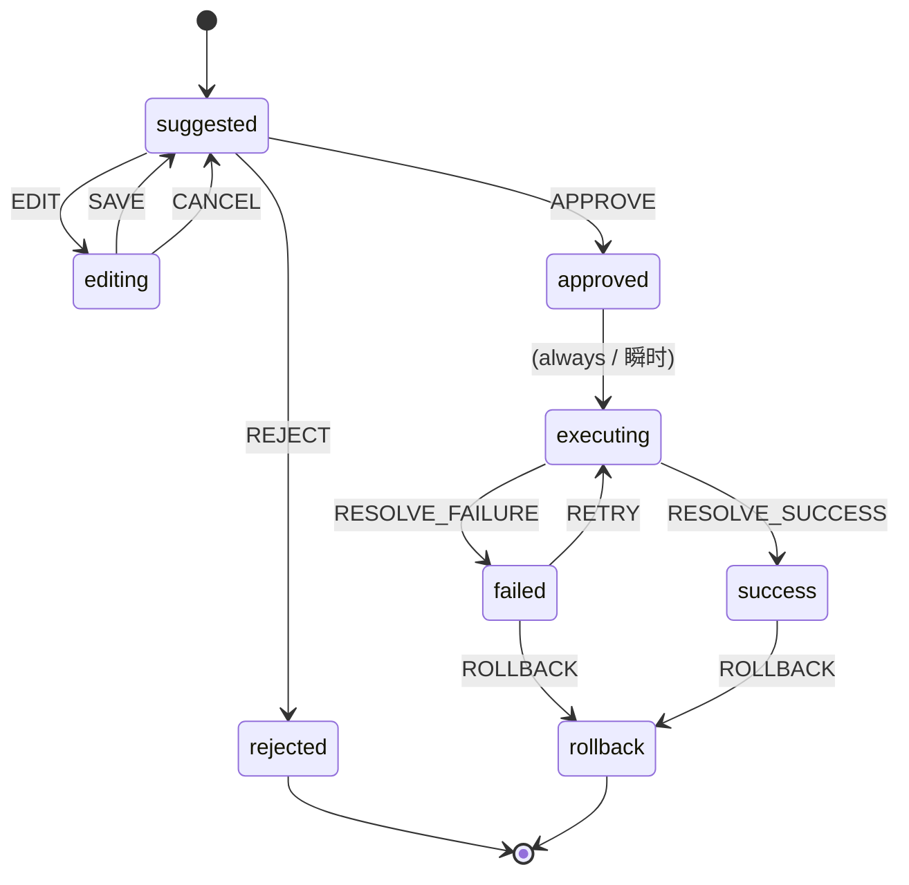

# STATE_MACHINE — ToolAction 审批状态机

> 本文档描述 `approvalMachine`（PRD §9.3 / §12.3）的实现。机器定义在
> `packages/shared/src/approval-machine.ts`，框架无关、无 React/UI（PRD §3.4 红线）；
> `@xstate/react` 绑定在各 app（web / mobile）实现。
> 本文档不改变 frozen spec（`docs/PRD.md`），只解释实现。

## 1. 定位

`approvalMachine` 是承重墙 ToolApprovalCard 的状态内核：把「AI 建议动作 → 人工裁决 → 执行 → 回滚」这条链路建模成显式状态机，避免散落在 `useState` 的 if-else（PRD §13.1.16 / §12.3）。

- **实例粒度：一个 ToolAction 一台机器实例**（每张 ToolApprovalCard 一台），不是每会话一台（PRD §12.2 / §12.3）。
- **技术栈：XState v5**（`xstate@^5.32.1`）。
- **纯净边界**：机器只管状态流转；副作用（Timeline 写入、mock 执行、参数校验）一律在 app 层完成，shared 不做 I/O。

## 2. 状态（8 态，PRD §9.3）

| 状态 | 含义 | 出向 |
|---|---|---|
| `suggested` | AI 建议态（初始态） | EDIT / APPROVE / REJECT |
| `editing` | 参数编辑态（编辑草稿） | SAVE / CANCEL |
| `approved` | **瞬时态**：批准即执行，不停留 | （自动）→ executing |
| `rejected` | **终态**：仅从 suggested 进入 | —（无出向） |
| `executing` | 执行中 | RESOLVE_SUCCESS / RESOLVE_FAILURE |
| `success` | 执行成功 | ROLLBACK |
| `failed` | 执行失败 | RETRY / ROLLBACK |
| `rollback` | **终态**：状态回滚 | —（无出向） |

## 3. 状态图



## 4. 转移表（PRD §9.3 全量）

| From | Event | To |
|---|---|---|
| suggested | EDIT | editing |
| suggested | APPROVE | approved |
| suggested | REJECT | rejected |
| editing | SAVE | suggested |
| editing | CANCEL | suggested |
| approved | （always，瞬时） | executing |
| executing | RESOLVE_SUCCESS | success |
| executing | RESOLVE_FAILURE | failed |
| failed | RETRY | executing |
| failed | ROLLBACK | rollback |
| success | ROLLBACK | rollback |

## 5. 设计注记（必须遵守，来自 §9.3）

- **`approved` 瞬时态**：PRD 要求「批准后立即触发 EXECUTE，不停留等待」。实现上 `approved` 用 XState `always` 自动转移到 `executing`——即推荐转移表里的 `approved --EXECUTE--> executing` 落地为自动转移。因此 app **不需要**手动派发 `EXECUTE`：发 `APPROVE` 后机器直达 `executing`。
- **`rejected` 终态**：只能从 `suggested` 进入（无 `approved → rejected`，故无需该转移）。建模为无出向转移的终态。
- **`rollback` 终态**：无出向转移。
- **`editing --CANCEL--> suggested`**：丢弃草稿、还原参数（与 SAVE 区分：SAVE 提交草稿）。
- 非法事件（如 `suggested` 收到 `RESOLVE_SUCCESS`）被忽略，状态不变。

## 6. 事件（`ApprovalEvent`）

`EDIT` / `APPROVE` / `REJECT` / `SAVE` / `CANCEL` / `RESOLVE_SUCCESS` / `RESOLVE_FAILURE` / `RETRY` / `ROLLBACK`。

均为无 payload 事件——机器只驱动状态；ToolAction 的业务数据（params / editedParams / failedReason 等）由数据层（TanStack Query / Zustand）持有（PRD §12）。

## 7. guards / actions

本期 MVP 的转移**无条件**，因此机器内**不设 guard**；副作用（Timeline 写入、mock 执行 promise、参数 Zod 校验）属 app 层 I/O，**不写进 shared 机器**以保持其纯净（PRD §3.4 / §12.3）。app 通过订阅状态变化或在 `createActor` 外围编排来落地这些副作用；机器用 `setup()` 定义，未来若需 guard/action 可在此扩展槽位。

> 红线（ADR-0001）：React 19 的 `useActionState` / `useOptimistic` / `use` 仅用于 UI 表现层；ToolAction 状态流转只由本机器驱动，不得用这些 hook 绕过状态机。

## 8. RN 裁决 → 状态机映射（PRD §5.2，全部复用现有转移，不新增）

```txt
RN 同意       → APPROVE → approved →(always)→ executing → success/failed
RN 拒绝       → REJECT  → rejected
RN 修改后同意 → EDIT → editing → SAVE → suggested → APPROVE → …（同“RN 同意”）
RN 稍后处理   → 不发事件：ApprovalTask.status='delayed'，ToolAction 保持 suggested
```

低风险动作（`requiresMobileApproval(riskLevel) === false`）的 `EDIT/APPROVE/REJECT` 由 Web 触发；达到阈值的由 RN 触发。一个 ToolAction 只有一个审批方（PRD §5.2）。

## 9. 契约测试

`packages/shared/src/approval-machine.test.ts`（随 `pnpm -w check` 跑）覆盖 §12 要求的三条关键路径
`suggested→approved→executing→success`、`executing→failed→rollback`、`editing→CANCEL→suggested`，
以及其余 §9.3 转移、瞬时 `approved`、`rejected`/`rollback` 终态、非法事件被忽略，共 11 条。
